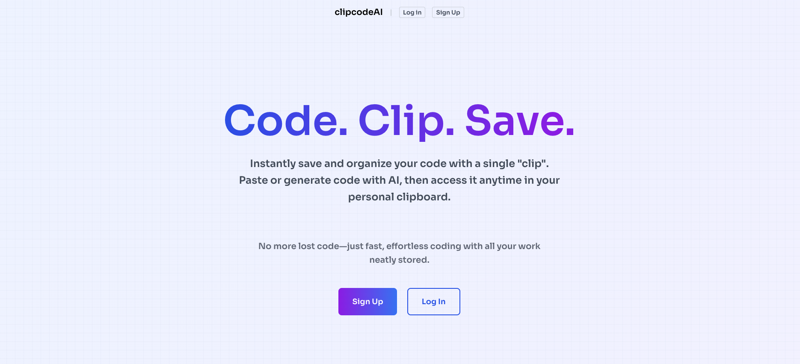
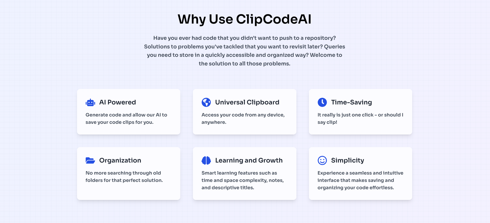
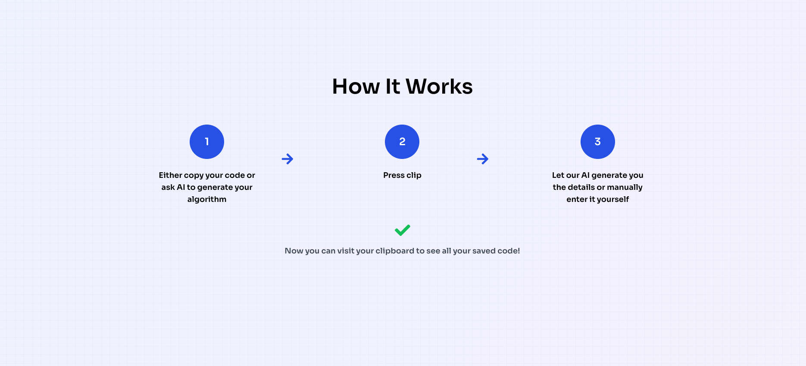
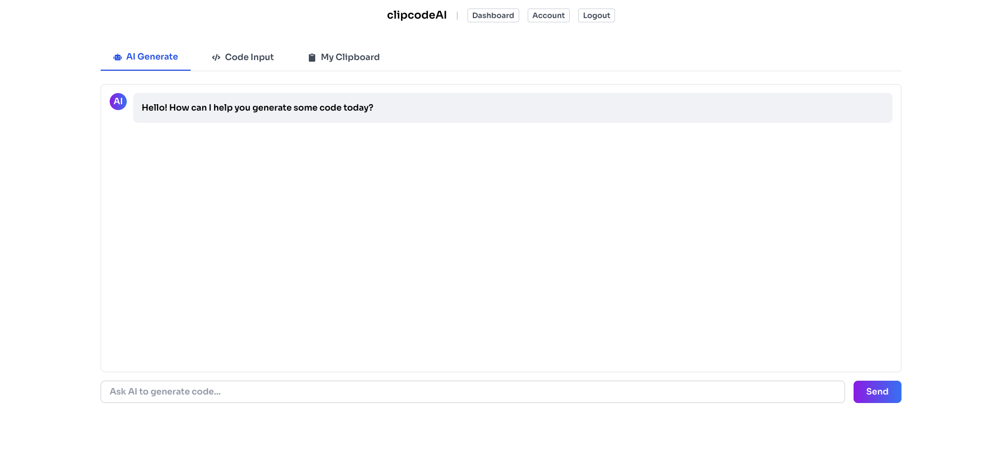
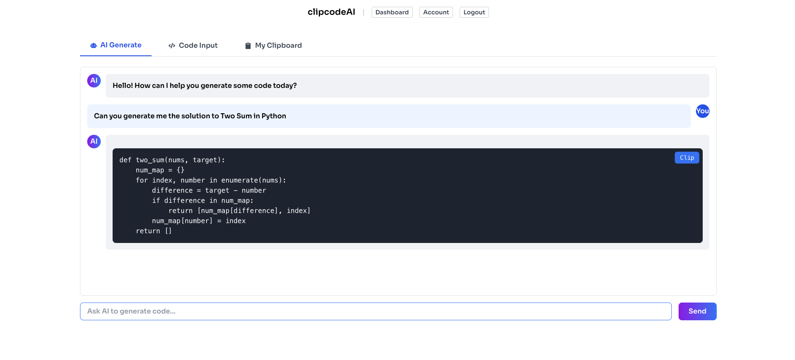
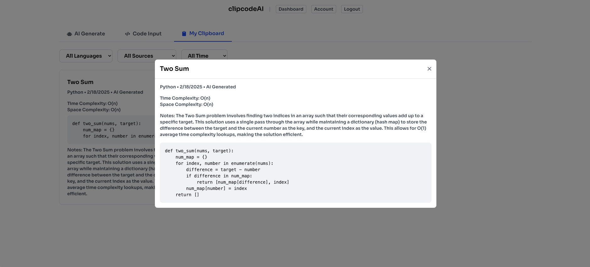
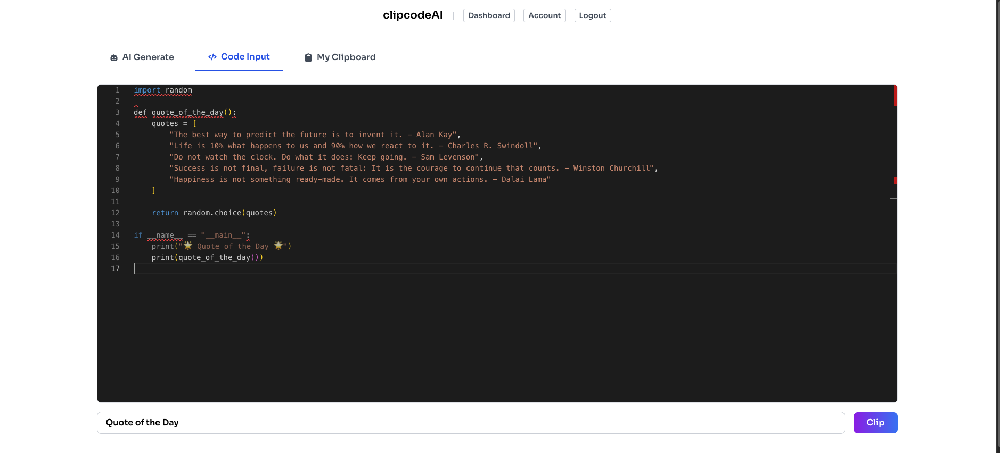

# ClipCodeAI

ClipCodeAI is a web application that allows users to interact with an AI-powered programming assistant. The application is built using FastAPI for the backend and React with Tailwind CSS for the frontend.





## Features

- AI-powered code suggestions and analysis
- User authentication with JWT
- Code clipping and management
- Responsive design with Tailwind CSS

## Prerequisites

- Python 3.8+
- Node.js 14+
- PostgreSQL
- Virtual Environment (venv)
- OpenAI API Key
- JWT Secret Key (Can be generated)

## Getting Started

### Backend Setup

1. **Clone the repository then:**

   ```bash
   cd clipcodeai/backend
   ```

2. **Create a virtual environment:**

   ```bash
   python -m venv venv
   ```

3. **Activate the virtual environment:**

   - On Windows:

     ```bash
     venv\Scripts\activate
     ```

   - On macOS and Linux:

     ```bash
     source venv/bin/activate
     ```

4. **Install the dependencies:**

   ```bash
   pip install -r requirements.txt
   ```

5. **Set up the environment variables:**

   Create a `.env` file in the `backend` directory with the following content:

   ```plaintext
   DATABASE_URL="your_postgres_database_url"
   JWT_SECRET_KEY="your_jwt_secret_key"
   OPENAI_API_KEY="your_openai_api_key"
   ```

   Replace the placeholders with your actual database URL, JWT secret key, and OpenAI API key.

6. **Run the database migrations:**

   ```bash
   prisma migrate deploy
   ```

7. **Start the FastAPI server:**

   ```bash
   uvicorn app.main:app --reload
   ```

   The backend server will be running at `http://localhost:8000`.

### Frontend Setup

1. **Navigate to the frontend directory:**

   ```bash
   cd ../frontend
   ```

2. **Install the dependencies:**

   ```bash
   npm install
   ```

3. **Start the React development server:**

   ```bash
   npm run dev
   ```

   The frontend application will be running at `http://http://localhost:5173`.

## Usage

1. Open your browser and navigate to `http://http://localhost:5173/`.
2. Sign up or log in to access the dashboard.
3. Interact with the AI assistant to get code suggestions and analysis.
4. Save your code clips for future reference.

## Views





